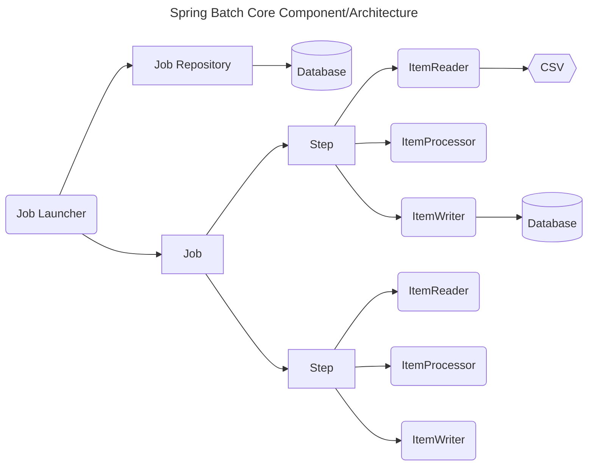

# Spring batch processing in Action
### A start-up guide to working in Spring Batch


#### Tech Stacks:
```
Java-17, Spring Boot 3, Spring Batch 5, MariaDB
```


### Ideas behind Spring batch


```mermaid
---
title: Spring Batch Core Component/Architecture
---
flowchart LR
    jl(Job Launcher) --> jr[Job Repository]
    jr --> db1[(Database)]
    jl --> jb[Job]
    jb --> st1[Step]
    jb --> st2[Step]
    st1 --> itr1(ItemReader)
    st1 --> itp1(ItemProcessor)
    st1 --> itw1(ItemWriter)
    st2 --> itr2(ItemReader)
    st2 --> itp2(ItemProcessor)
    st2 --> itw2(ItemWriter)
    itr1 --> csv{{CSV}}
    itw1 --> db2[(Database)]
    


```